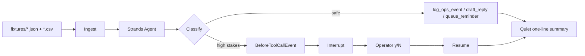
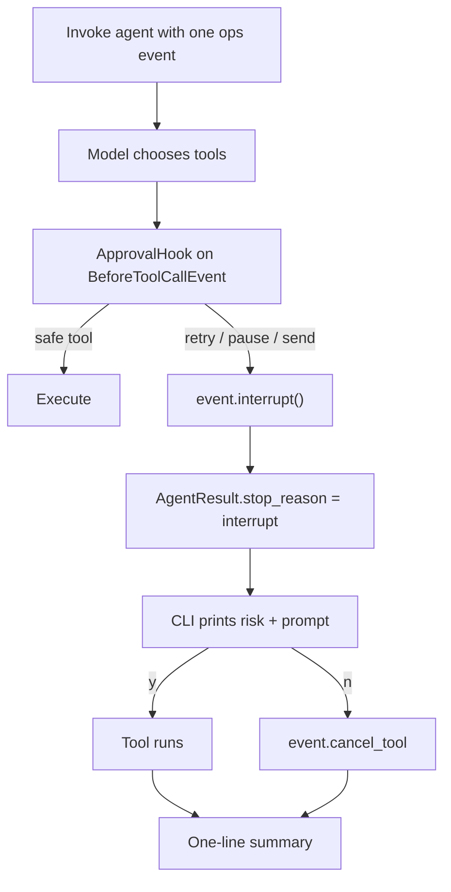

# Agency Ops

A background [Strands](https://strandsagents.com/docs/user-guide/quickstart/python/) agent for solo operators and tiny digital agencies. It eats repetitive ops busywork — failed n8n runs, inbound leads, SKU stock — and **only taps you when a decision could charge a card, email a customer, or take a listing down.**

Built for the **AWS Agents for Humans** hackathon, Professional / Work Amplifier track.

> The default demo is fully offline. No AWS account, no secrets. `--live` switches the same tools and hooks onto Amazon Bedrock.

## Who it's for

Avery runs Northline Studio alone. n8n moves leads. Gumroad sells a playbook and a few audit slots. Most mornings start the same way: a red workflow, a form submission, a “3 copies left” ping — an hour of triage before any billable work.

Avery does not want another chatbot. Avery wants a quiet desk that:

1. Logs the timeout and sets a reminder.
2. Drafts the bakery-site reply (and does **not** send it).
3. Stops and asks before retrying Stripe fulfillment or unpublishing a sold-out SKU.

## Why it matters

Background agents fail in two directions: they nag you about everything, or they act on money paths without asking. Agency Ops is opinionated about the cut.

| Event | Auto-handle | Needs you |
| --- | --- | --- |
| n8n timeout / 5xx, no side effects | Log + reminder | |
| Standard inbound lead | Draft reply | |
| Low stock, still sellable | Reorder reminder | |
| 401 on a payment workflow | | Approve retry |
| SKU at 0 units | | Approve pause |
| Refund / legal / enterprise lead | | Approve send |

High-stakes tools never execute until a Strands `BeforeToolCallEvent` hook raises an **interrupt**. The agent loop pauses; you answer `y` or `n`; the hook either lets the tool run or cancels it.

## How to run

Python 3.10+. From the repo root:

```bash
python3 -m pip install -r requirements.txt

# Sample Tuesday. Offline policy model. High-stakes actions are denied unless you pass --approve y.
python3 -m agency_ops --approve n
```

That command is the documented demo. You should see auto-handled rows **and** decision prompts for the Stripe 401 and the sold-out SKU.

```bash
# Show both sides of the interrupt:
python3 -m agency_ops --only evt-002 --approve n          # auto: draft, never sent
python3 -m agency_ops --only evt-004 --approve y          # human: retry after approval
python3 -m agency_ops --only evt-005 --approve n          # human: pause held

# Interactive prompts (TTY):
python3 -m agency_ops --approve ask
```

Fixtures live in `fixtures/day.json` (n8n + leads + SKUs) and `fixtures/sku_issues.csv` (extra stock row). The agent writes drafts and logs under `data/` (override with `AGENCY_OPS_DATA_DIR`).

```bash
python3 -m pytest -q
```

## Live Bedrock (optional)

Default model provider is Amazon Bedrock, matching the [Strands Python quickstart](https://strandsagents.com/docs/user-guide/quickstart/python/).

1. Copy `.env.example` and export credentials — `AWS_ACCESS_KEY_ID` / `AWS_SECRET_ACCESS_KEY` / `AWS_REGION`, or `AWS_BEARER_TOKEN_BEDROCK`, or an instance role.
2. Enable the model in Bedrock (default `AGENCY_OPS_MODEL=global.anthropic.claude-sonnet-4-6`).
3. Run:

```bash
python3 -m agency_ops --live --approve ask
```

No secrets are stored in this repo.

## Architecture





### Pieces

| Path | Role |
| --- | --- |
| `agency_ops/agent.py` | System prompt + `Agent(...)` factory |
| `agency_ops/tools.py` | `@tool` functions; `HIGH_STAKES_TOOLS` |
| `agency_ops/hooks.py` | `ApprovalHook` (`BeforeToolCallEvent` / interrupt) + trace hook |
| `agency_ops/offline_model.py` | Custom `Model` so the demo runs without Bedrock |
| `agency_ops/policy.py` | Deterministic classify / plan used by the offline model |
| `agency_ops/cli.py` | Sample-day runner |
| `docs/AGENTCORE.md` | How this would sit on Bedrock AgentCore Runtime |

Live Bedrock uses the same tools and hooks. The offline model exists so judges and CI can see an auto-handle **and** a human interrupt without credentials.

## Product principles

- **Quiet by default.** The CLI prints a day table, not a transcript. `--verbose` streams Strands callbacks.
- **Draft ≠ send.** `draft_reply` writes `data/drafts.jsonl`. `send_customer_email` is gated.
- **Money paths pause.** `retry_n8n_workflow` and `pause_sku` always interrupt, even if the model is eager.
- **No secrets in git.** Env vars only. Offline path is first-class.

## License

MIT. See `LICENSE`.
